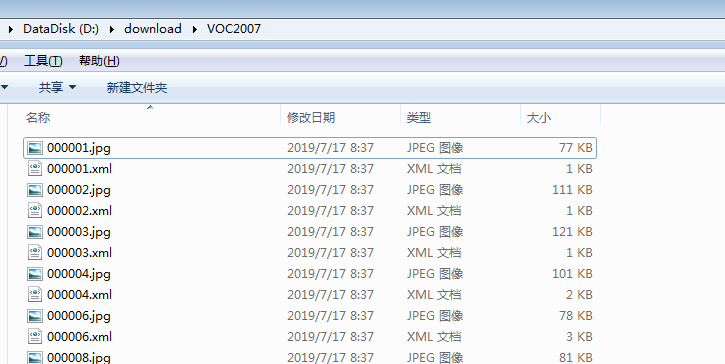
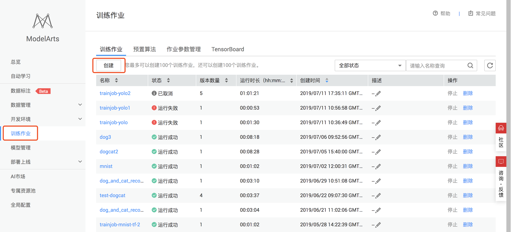
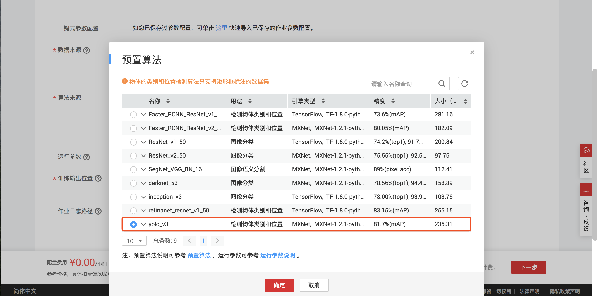
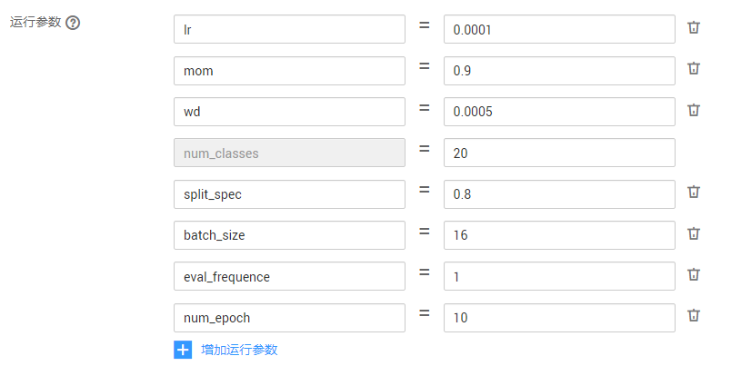
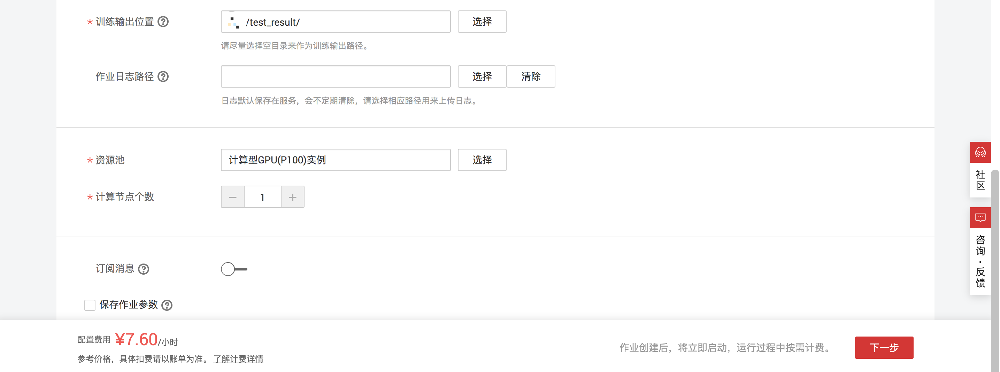
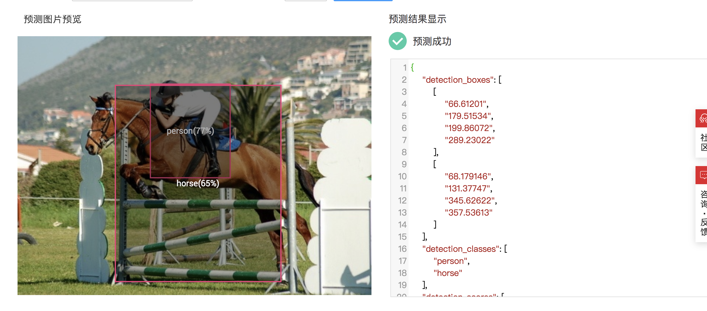

# 物体检测YOLO V3算法实践-使用ModelArts预置算法

YOLO场景运用：
YOLO作为一个one-stage目标检测算法，在速度和准确度上都有杰出的表现。

除了在Notebook开发环境中进行算法的定义和运行，通过ModelArts预置算法同样可以进行YOLO算法的训练和推理。接下来的例子就是一个利用ModelArts中的YOLO V3预置算法进行的训练和推理过程。

## 第一步：准备数据

有很多开源的数据集可以用来进行目标检测任务的训练，如COCO数据集，PASCAL VOC数据集，BDD100K等，可以根据不同的需求和偏好进行选择。在获得数据集之后，需要对数据进行格式统一，然后便可以进行训练了。

本案例中使用的是PASCAL VOC2007，数据下载地址如下，点击即开始下载：

http://host.robots.ox.ac.uk/pascal/VOC/voc2007/VOCtrainval_06-Nov-2007.tar

本地解压数据集，本案例只需要将VOC2007下的两个文件夹`Annotations`（标注数据） 和 `JPEGImages`（图像数据）下的所有文件放入一个文件夹中（如：VOC2007），准备好的文件夹的如下图所示：

然后将这个文件夹上传到OBS中（使用OBS客户端上传文件夹至OBS的指导见[本文档](https://support.huaweicloud.com/qs-obs/obs_qs_0002.html)）。

数据准备以下面的文档为参考，有兴趣的同学可以尝试不同的数据集：

https://support.huaweicloud.com/engineers-modelarts/modelarts_23_0005.html

## 第二步：创建训练任务

首先，进入训练任务界面，点击创建

然后根据需求进行作业参数定义：
训练作业名称需自定义

在预置算法列表中选择`yolo_v3`

数据来源选择在第一步中存储的数据位置

模型参数设置参考文档及个人需求进行定义：

https://support.huaweicloud.com/engineers-modelarts/modelarts_23_0045.html

本案例使用如下的参数设置，其他案例请根据具体情况设置参数。本案例中建议设置`batch_size`为16。

选择一个空文件夹作为训练结果的输出路径，完成训练作业的定义。

训练时长大概40到50分钟左右，如果遇到使用高峰期，时间可能更长。

## 第三步：查看训练情况

- 通过训练日志
可以通过训练时候的日志查看训练情况，训练日志可以进行在线查看和下载。

- 创建TensorBoard
点击创建TensorBoard，可以看到训练信息的图表展示。

更多训练情况查询请参考：

https://support.huaweicloud.com/engineers-modelarts/modelarts_23_0048.html

## 第四步：导入模型
进入模型管理界面，点击导入

接下来我们将之前训练得到的模型进行导入和部署。
模型名称需自定义

除了将训练中的模型进行导入之外，ModelArts还提供了多种模型导入方式，如从模板中选择，从容器景象中选择，从OBS中选择。例子中为从训练中导入，其他的具体操作方式参考文档：

https://support.huaweicloud.com/engineers-modelarts/modelarts_23_0054.html

## 第五步：部署服务
ModelArts提供了在线部署服务，可以对模型进行在线推理。首先进入在线部署界面，点击部署：

选择需要部署的模型及版本：部署名称需自定义

完成部署服务之后，可以在线推理测试：

